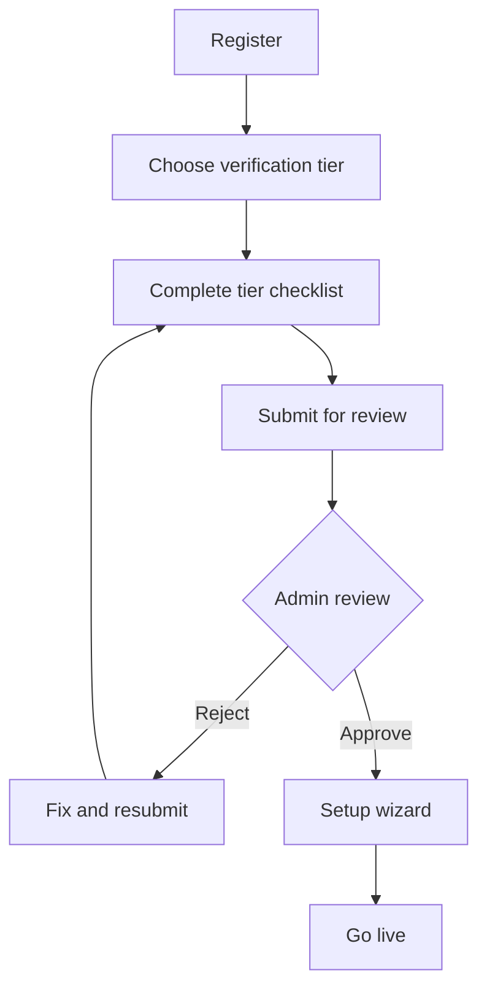
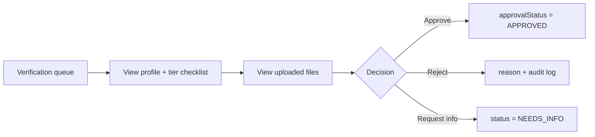

# Inclusive KYC & Verification — Implementation Plan

**Feature:** Know Your Customer (KYC) / distributor verification with **tiered, inclusive** rules  
**Status:** Planning only — **not implemented** (awaiting product go-ahead)  
**Prerequisite:** Phase 1 complete (auth, profiles, admin verification queue, dual onboarding)  
**Estimated effort:** 3–5 weeks (1 FE + 1 BE + QA), depending on tier chosen at build time  
**Last updated:** June 2026

**Related docs:** [PHASE_1_Core_Platform.md](./PHASE_1_Core_Platform.md) · [00_IMPLEMENTATION_OVERVIEW.md](./00_IMPLEMENTATION_OVERVIEW.md)

---

## 1. Why this feature

Phase 1 admin verification is **manual approve/reject** based on profile fields only. There is **no document upload**, no structured identity check, and no audit trail for what was reviewed.

This plan adds **optional-but-structured verification** so the platform can:

- Build trust between customers and distributors
- Give admins a clear review checklist
- Support **small farmers and household milk sellers** who may **not** have GSTIN, FSSAI, or formal shop registration
- Stay ready for Phase 3 (payments / payouts) without blocking rural or informal vendors today

**Core product principle:** *No user is excluded because they lack corporate documents.*

---

## 2. Design principles

| Principle | Meaning |
|-----------|---------|
| **Tiered, not one-size-fits-all** | Different proof sets for small farmer vs local dairy vs registered business |
| **GSTIN & FSSAI never required globally** | Always optional; only suggested for tiers that typically have them |
| **Alternatives for rural/informal** | Village address, map pin, local reference, self-declaration, photo of delivery point |
| **Progressive trust** | Start with minimum to go live; stricter checks only when needed (online payouts, high volume) |
| **Admin override** | Super Admin can approve with notes when documents are incomplete but trust is established |
| **Privacy by default** | Minimize stored ID data; encrypt sensitive fields; clear retention policy |
| **i18n-ready** | All labels and declarations in English + Hindi (reuse existing `next-intl` stack) |

---

## 3. Who needs what (summary)

| Role | KYC depth | Blocks go-live? |
|------|-----------|-----------------|
| **Distributor — Tier A** (small farmer / household) | Light: identity + location + declaration | Yes — minimum tier must be complete |
| **Distributor — Tier B** (local vendor / small dairy) | Medium: + optional business proof | Yes |
| **Distributor — Tier C** (registered business) | Full: optional GSTIN, FSSAI, bank (future) | Yes |
| **Customer** | Minimal: phone + delivery address (already Phase 1) | No extra KYC for subscribe |
| **Customer** (Phase 3+ payments) | Phone OTP verification | Optional gate before online pay |

---

## 4. Distributor verification tiers

User **selects tier at registration** (can upgrade later). Admin sees tier-specific checklist.

### Tier A — Small farmer / household seller

*Target: village milk producer, 5–20 households, no shop license.*

| Field / proof | Required? | Notes |
|---------------|-----------|--------|
| Full name | Yes | Match account |
| Phone | Yes | Already collected; OTP in Phase 3 |
| Photo (optional selfie) | Recommended | Builds trust; not blocking in MVP |
| **Structured address** (rural supported) | Yes | Reuse Phase 1 address model |
| **Map pin** (delivery/service location) | Yes | Reuse geocoding |
| **Self-declaration** | Yes | Checkbox + timestamp: “I sell milk I produce or collect locally” |
| Village / landmark | Yes | Already in rural address |
| Reference contact (optional) | No | Neighbour / panchayat / existing customer phone |
| GSTIN | **No** | Hidden for this tier |
| FSSAI | **No** | Hidden for this tier |
| PAN | **No** | Not required to go live |

**Minimum to submit for review:** name, phone, rural/urban address, map pin, declaration accepted.

---

### Tier B — Local vendor / small dairy booth

*Target: local doodh wala, small booth, may have informal business name.*

| Field / proof | Required? | Notes |
|---------------|-----------|--------|
| Everything in Tier A | Yes | |
| Business / shop name | Yes | Already `businessName` |
| Owner name | Yes | Already `ownerName` |
| Shop / delivery point photo | Recommended | Single JPG; admin review |
| Business address proof | **One of** (optional) | Electricity bill, rent receipt, trade license photo — **OR** map pin + 6 months platform good standing |
| GSTIN | **Optional** | Field shown; “I don’t have GST” path |
| FSSAI | **Optional** | Field shown; “Not applicable / exempt” path |
| PAN | Optional | For future payouts only |

**Minimum to submit:** Tier A minimum + business name + owner name.

---

### Tier C — Registered dairy / business

*Target: registered firm, FSSAI-licensed unit, GST-registered distributor.*

| Field / proof | Required? | Notes |
|---------------|-----------|--------|
| Everything in Tier B | Yes | |
| GSTIN | **Optional** | Validated format if provided |
| FSSAI license number + scan | **Optional** | Expiry date if provided |
| PAN | Optional until Phase 3 payouts | |
| Bank account | Phase 3 | For settlements only |

**Minimum to submit:** Same as Tier B. Tier C is an **enrichment path**, not a harder gate.

---

## 5. Customer verification (minimal)

Customers stay **low-friction** to maximize access.

| Item | Phase | Required? |
|------|-------|-------------|
| Name, email, password | 1 | Yes (existing) |
| Delivery address + geocode | 1 | Yes (existing) |
| Phone | 1 | Yes (existing) |
| Phone OTP | 3 | Recommended before online payment |
| ID document upload | — | **Out of scope** unless credit/wallet rules change |

**No GSTIN, FSSAI, or ID upload for customers** in initial KYC scope.

---

## 6. Lifecycle & flows

### 6.1 Distributor flow (extends Phase 1)



**Changes from today:**

- Insert **Choose tier + KYC checklist** between Register and Admin review
- `approve` blocked until `kycStatus = SUBMITTED` and required tier fields complete
- Reject reason + optional “request specific document” notes

### 6.2 Admin flow



Extend existing `/admin/verification` — do not create a separate silo unless queue volume demands it.

---

## 7. KYC status model

### 7.1 Enums (proposed)

```
DistributorTier:     TIER_A | TIER_B | TIER_C
KycStatus:           NOT_STARTED | IN_PROGRESS | SUBMITTED | NEEDS_INFO | APPROVED | REJECTED | EXPIRED
KycDocumentType:     SELFIE | SHOP_PHOTO | ADDRESS_PROOF | GST_CERT | FSSAI_CERT | PAN_CARD | BANK_PROOF | OTHER
KycDocumentStatus:   PENDING | ACCEPTED | REJECTED
```

### 7.2 Prisma additions (proposed)

| Model / field | Purpose |
|---------------|---------|
| `DistributorProfile.tier` | A / B / C |
| `DistributorProfile.kycStatus` | Workflow state |
| `DistributorProfile.kycSubmittedAt` | Timestamp |
| `DistributorProfile.declarationAcceptedAt` | Tier A legal ack |
| `DistributorProfile.gstin` | Optional, nullable |
| `DistributorProfile.fssaiNumber` | Optional, nullable |
| `DistributorProfile.fssaiExpiresAt` | Optional |
| `DistributorProfile.pan` | Optional, encrypted |
| `KycDocument` | file metadata per upload |
| `KycReview` | admin actions (or extend `audit_logs`) |

**No new customer KYC tables** in v1 unless phone OTP is modeled separately in Phase 3.

---

## 8. Document storage & security

| Requirement | Approach |
|-------------|----------|
| Storage | S3-compatible (AWS S3 / MinIO / R2) |
| Upload | Presigned PUT URLs from backend |
| Types | PDF, JPG, PNG; max 5 MB per file |
| Access | Authenticated; admin-only read; distributor read own files only |
| Encryption | At rest (bucket SSE); PAN/GSTIN encrypted in DB |
| Malware | ClamAV or cloud scan on upload |
| Retention | Configurable (default 7 years after account closure for disputes/tax) |
| DPDP | Consent checkbox at upload; privacy policy link; export/delete hooks |

**Do not store raw Aadhaar** in v1. If e-KYC is added later, use a licensed partner and store only reference tokens.

---

## 9. API surface (proposed)

### 9.1 Distributor

| Method | Path | Description |
|--------|------|-------------|
| GET | `/api/distributor/kyc/requirements` | Checklist for current tier |
| PATCH | `/api/distributor/kyc/tier` | Set tier (only before SUBMITTED) |
| PATCH | `/api/distributor/kyc/fields` | Optional GSTIN, FSSAI, PAN, declaration |
| POST | `/api/distributor/kyc/documents/presign` | Get upload URL |
| POST | `/api/distributor/kyc/documents/confirm` | Register uploaded file |
| DELETE | `/api/distributor/kyc/documents/{id}` | Remove pending doc |
| POST | `/api/distributor/kyc/submit` | Move to SUBMITTED |
| GET | `/api/distributor/kyc/status` | Current state + missing items |

### 9.2 Admin

| Method | Path | Description |
|--------|------|-------------|
| GET | `/api/admin/kyc/pending` | Queue (filter by tier, status) |
| GET | `/api/admin/kyc/{distributorId}` | Full checklist + documents |
| POST | `/api/admin/kyc/{distributorId}/request-info` | NEEDS_INFO + message |
| POST | `/api/admin/distributors/{id}/approve` | **Extend:** require kycStatus |
| POST | `/api/admin/distributors/{id}/reject` | Existing + optional doc feedback |

### 9.3 Error codes (extend existing `ApiErrorCode`)

- `KYC_INCOMPLETE`
- `KYC_ALREADY_SUBMITTED`
- `KYC_DOCUMENT_INVALID`
- `KYC_TIER_LOCKED`

---

## 10. Frontend scope

### 10.1 Distributor

| Screen | Route (proposed) | Notes |
|--------|------------------|-------|
| Tier selection | `/distributor/kyc/tier` or step 0 of setup | Plain-language Hindi + English |
| KYC checklist | `/distributor/kyc` | Dynamic by tier; optional fields collapsed |
| Document upload | Inline on checklist | Mobile camera friendly |
| Status / resubmit | `/distributor/kyc/status` | After reject or NEEDS_INFO |

**Copy guidelines:**

- Tier A labeled: “Small farmer / household seller” / “छोटे किसान / घरेलू विक्रेता”
- Never show “Required: GSTIN” on Tier A/B default path
- “I don’t have this document” → hide field, log declaration

### 10.2 Admin

| Screen | Change |
|--------|--------|
| `/admin/verification` | Add tier badge, checklist completion %, document viewer |
| Distributor detail drawer | Link to KYC documents |

### 10.3 Customer

No new screens in v1.

### 10.4 i18n

New namespaces: `kyc.tiers`, `kyc.documents`, `kyc.declaration`, `kyc.admin`

---

## 11. Integration with existing Phase 1

| Existing | KYC integration |
|----------|-----------------|
| `ApprovalStatus` PENDING/APPROVED/REJECTED | Unchanged; gated by `kycStatus` |
| Admin verification page | Extended UI |
| `audit_logs` | Log approve/reject/doc view |
| Structured address + map pin | Counts as Tier A location proof |
| `distributor-approved.guard` | Unchanged after approval |
| Setup wizard | Runs **after** KYC approved (or parallel with IN_PROGRESS — product choice below) |

**Open product choice (decide before build):**

| Option | Pros | Cons |
|--------|------|------|
| **A — KYC before setup wizard** | Clean trust gate | Slower time-to-live |
| **B — KYC parallel with setup** | Faster onboarding | Admin reviews more data at once |
| **Recommended:** Option A for pilot; Option B if drop-off is high |

---

## 12. Phased delivery (when approved)

### Phase KYC-1 — Inclusive MVP (2–3 weeks)

- Tier A + B selection and checklists
- Self-declaration + optional photo upload
- Admin queue extensions + document viewer
- Manual review only (no third-party API)
- Block approve until tier minimum met
- English + Hindi strings

### Phase KYC-2 — Optional enrichments (1–2 weeks)

- Tier C optional GSTIN/FSSAI fields with format validation
- Expiry reminders for FSSAI (notification stub)
- `NEEDS_INFO` loop for resubmit

### Phase KYC-3 — Trust services (optional, post Phase 3)

- Phone OTP for distributors and customers
- PAN/GST verification API (only if user entered values)
- Bank penny-drop before payouts
- e-KYC partner evaluation (Aadhaar — legal review required)

---

## 13. Testing & acceptance criteria

| ID | Scenario | Expected |
|----|----------|----------|
| KYC-01 | Tier A farmer registers without GSTIN/FSSAI | Can submit and appear in admin queue |
| KYC-02 | Tier A without map pin | Submit blocked with clear message |
| KYC-03 | Admin approves Tier A with declaration only | Distributor enters setup wizard |
| KYC-04 | Admin rejects with reason | Distributor sees NEEDS_INFO / REJECTED; can fix |
| KYC-05 | Tier C user skips GSTIN and FSSAI | Still allowed to submit (optional fields) |
| KYC-06 | Customer self-register | No KYC screens added |
| KYC-07 | Hindi UI on Tier A | All required labels translated |
| KYC-08 | Mobile upload shop photo | Works on 375px viewport |
| KYC-09 | Unauthorized user fetches another’s document | 403 |
| KYC-10 | Approve without SUBMITTED kycStatus | 400 `KYC_INCOMPLETE` |

---

## 14. Compliance notes (India)

| Topic | Guidance for this product |
|-------|---------------------------|
| **DPDP Act** | Consent at declaration + upload; purpose: platform verification only |
| **Small producers** | Many are exempt from FSSAI licensing below certain scale — do not require certificate |
| **GST** | Many below threshold — optional field only |
| **Aadhaar** | Avoid storage in MVP; use partner e-KYC only if legally required later |
| **Audit** | Retain admin decisions + document hashes |

*This document is not legal advice. Product owner should confirm tier rules with counsel before launch.*

---

## 15. Effort & roles

| Workstream | Estimate |
|------------|----------|
| Schema + migrations | 2–3 days |
| Storage + presign API | 3–4 days |
| Distributor KYC APIs + validation | 4–5 days |
| Admin API + audit | 2–3 days |
| Distributor FE (tier + checklist + upload) | 5–6 days |
| Admin FE (viewer + checklist) | 3–4 days |
| i18n (en/hi) | 1–2 days |
| QA + security review | 3–4 days |
| **Total** | **~3–5 weeks** |

---

## 16. Out of scope (this feature)

- Mandatory GSTIN or FSSAI for any tier
- Customer ID document upload
- Automated Aadhaar e-KYC (deferred to KYC-3)
- OCR auto-fill from document photos
- Video KYC / liveness (unless fraud requires later)
- Cross-border / non-India ID types

---

## 17. Definition of done

- [ ] Distributor can complete Tier A without GSTIN, FSSAI, or PAN
- [ ] Admin can review checklist + optional documents in one queue
- [ ] Approve/reject audited; documents stored securely
- [ ] Hindi + English UI for all KYC screens
- [ ] Phase 1 flows unchanged for customers
- [ ] `KYC_Checklist.md` tracker created when implementation starts

---

## 18. When implementation starts

1. Product confirms **Option A vs B** (KYC before vs parallel to setup wizard).
2. Create `docs/implementation/KYC_Checklist.md` (file-by-file FE/BE tracker).
3. Add KYC row to [PHASE_1_Checklist.md](./PHASE_1_Checklist.md) or standalone sprint board.
4. Run `prisma db push` after schema migration.

**Until then:** this document is the single source of truth — no code changes required.

---

## 19. Decision log

| Date | Decision | Rationale |
|------|----------|-----------|
| June 2026 | GSTIN & FSSAI **optional for all tiers** | Small farmers and household sellers must not be blocked |
| June 2026 | Three distributor tiers (A/B/C) | Progressive trust without exclusion |
| June 2026 | Customer KYC unchanged in v1 | Keep product accessible; OTP deferred to Phase 3 |
| June 2026 | Manual admin review for MVP | No vendor cost; sufficient for pilot scale |
| — | KYC before vs parallel setup | **Pending** product decision at implementation time |
