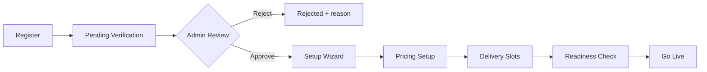
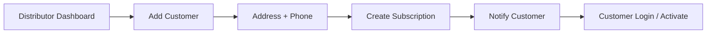
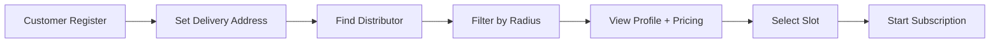

# Phase 1 — Core Platform Implementation Plan

**Phase:** 1 of 5  
**Focus:** Authentication, RBAC, distributor setup wizard, dual customer onboarding, subscription engine  
**Estimated duration:** 8–10 weeks (Sprints 1–2)  
**Sources:** PRD v2/v3/v6, Product Bible v4/v5, Implementation Guide v7, Execution Book v8  
**Implementation checklist:** [PHASE_1_Checklist.md](./PHASE_1_Checklist.md) (FE + BE task breakdown)

---

## 1. Phase Objectives

1. Establish multi-tenant SaaS foundation with three roles: Super Admin, Distributor, Customer.
2. Complete distributor lifecycle: register ? verification ? setup wizard ? go live.
3. Enable **two valid customer onboarding paths**:
   - **Distributor-led:** distributor creates customer record and subscription.
   - **Self-service:** customer discovers distributor by **distance radius filter** and self-subscribes.
4. Ship subscription engine with core frequencies and pause/extra request foundations.
5. Deliver role-specific dashboards with module-level RBAC.

## 2. In Scope

| Area | Included |
|------|----------|
| Auth | Email/password registration, login, JWT + refresh tokens, password reset |
| RBAC | Super Admin, Distributor, Customer permission matrix |
| Admin | Verification queue, distributor lifecycle, customer monitoring, platform KPIs |
| Distributor | Setup wizard, products/pricing, delivery slots, customer CRUD, subscription CRUD |
| Customer | Profile, geocoded address, distributor discovery (radius), subscription setup |
| Subscription | Daily, alternate day, weekdays, weekly, monthly |
| Product catalog | Milk variants (species + fat %), curd, paneer, eggs, lassi, ghee, butter, khoya |

## 3. Out of Scope (Deferred)

- Automated delivery list generation (Phase 2)
- Invoice generation and payment collection (Phases 2–3)
- SMS / WhatsApp / Email notifications (Phase 2+)
- OTP login (Phase 3)
- Mobile native apps (Phase 3)
- Route optimization, analytics dashboards, loyalty (Phases 4–5)

---

## 4. User Flows

### 4.1 Distributor Onboarding



**Setup wizard steps:**

1. Business profile (name, service area, contact, logo optional)
2. Product catalog — enable products from master list
3. Pricing — base price + fat-based milk pricing matrix
4. Delivery slots — morning/evening windows with capacity (optional v1)
5. Readiness checklist — all required fields green ? `go_live`

### 4.2 Customer Onboarding — Path A (Distributor-Led)



**Distributor actions:**
- Create customer with name, phone, delivery address
- Assign default delivery slot
- Create subscription (product, quantity, frequency, start date)
- Optionally send activation link / temporary credentials

**Customer actions:**
- Complete profile on first login
- View subscription, request pause/extra (UI stub OK; engine rules in Phase 1, billing impact Phase 2)

### 4.3 Customer Onboarding — Path B (Self-Service + Radius Discovery)



**Discovery requirements:**

| Requirement | Detail |
|-------------|--------|
| Customer address | Geocoded lat/lng stored on `CustomerProfile` |
| Distributor service area | Centroid or polygon + max service radius on `DistributorProfile` |
| Radius filter | Customer-selectable: 1 km, 3 km, 5 km, 10 km (configurable defaults) |
| Sort order | Distance ascending; secondary: rating/reviews (future) |
| Eligibility | Only `approved` + `go_live` distributors with pricing + slots |
| Result card | Name, distance, products summary, slot availability, min order hints |

**API sketch:**

```
GET /api/customers/distributors/nearby?lat={lat}&lng={lng}&radiusKm={n}&page={p}
```

Use Haversine or PostGIS `ST_DWithin` for distance query. Index on distributor geo fields.

### 4.4 Subscription Decision Tree (Execution Book v8)

```
Customer selects distributor
    ? Is distributor go_live? ?No? Show "not accepting subscriptions"
    ? Yes ? Has active pricing for product? ?No? Block
    ? Yes ? Slot available? ?No? Show alternate slots
    ? Yes ? Create subscription (status: active)
    ? Set billing_activation_date (Phase 2 hook)
```

---

## 5. Module Implementation

### 5.1 Super Admin Panel

| Screen | Features | Acceptance criteria |
|--------|----------|---------------------|
| Dashboard | KPIs: distributors, customers, active subscriptions | Loads < 2s with seed data |
| Verification queue | Approve/reject distributor with reason | Status transitions audited |
| Distributors | List, filter, lifecycle states | Admin can suspend distributor |
| Customers | Cross-distributor monitoring | Read-only customer detail view |
| Subscriptions | Platform-wide subscription list | Filter by status, distributor |
| Settings | Platform config, cutoff defaults | Changes persisted and audited |

### 5.2 Distributor Panel

| Screen | Features | Acceptance criteria |
|--------|----------|---------------------|
| Dashboard | Today's snapshot, pending actions | Shows setup progress if not live |
| Customers | CRUD, search, onboard on behalf | Created customer linked to distributor |
| Products & pricing | Catalog toggle, fat-based milk matrix | Price changes versioned or effective-dated |
| Delivery slots | CRUD morning/evening slots | At least one slot required for go-live |
| Subscriptions | Create/edit/pause flag for customer | Validates product + slot + frequency |
| Settings | Business profile, service radius | Radius used in discovery index |

### 5.3 Customer Panel

| Screen | Features | Acceptance criteria |
|--------|----------|---------------------|
| Find Distributor | Map/list, radius filter, detail view | Returns only eligible distributors sorted by distance |
| Active subscription | View/modify quantity, frequency | Changes respect cutoff rules (config) |
| Pause requests | Submit pause for date range | Stored; delivery/billing apply Phase 2 |
| Extra milk requests | One-off quantity bump by date | Stored; delivery/billing apply Phase 2 |
| Profile | Address update triggers re-discovery | Geo recalculated on save |

---

## 6. Subscription Engine — Phase 1 Rules

| Frequency | Delivery days logic |
|-----------|---------------------|
| Daily | Every calendar day |
| Alternate day | Every other day from start date |
| Weekdays | Mon–Fri only |
| Weekly | Same weekday each week |
| Monthly | Same date each month (handle month-end edge) |

**Pause rules (store now, enforce Phase 2):**
- Customer submits pause before configured cutoff (e.g. 8 PM previous day)
- Pause reduces future delivery quantities; billing adjustment in Phase 2

**Extra milk rules (store now, enforce Phase 2):**
- Customer requests additional quantity for specific date(s)
- Stored as adjustment record linked to subscription

---

## 7. Data Model — Phase 1 Entities

### Core tables

```
users
  id, email, phone, password_hash, role, status, created_at

distributor_profiles
  id, user_id, business_name, approval_status, setup_status,
  service_lat, service_lng, service_radius_km, go_live_at

customer_profiles
  id, user_id, delivery_lat, delivery_lng, address_line, city, pincode

distributor_customers          -- many-to-many if customer switches distributor later
  distributor_id, customer_id, onboarded_via (distributor_led | self_service)

products
  id, sku, name, category, species (nullable), unit

pricing
  id, distributor_id, product_id, fat_percent (nullable),
  price_per_unit, effective_from, active

delivery_slots
  id, distributor_id, label, start_time, end_time, active

subscriptions
  id, distributor_id, customer_id, product_id, quantity,
  frequency, delivery_slot_id, start_date, status, created_via

subscription_pauses
  id, subscription_id, start_date, end_date, status, requested_at

subscription_extras
  id, subscription_id, date, extra_quantity, status, requested_at

audit_logs
  id, actor_id, action, entity_type, entity_id, payload, created_at
```

### Indexing

- `distributor_profiles (approval_status, setup_status)` for discovery filter
- Geo index on `(service_lat, service_lng)` or PostGIS geometry
- `subscriptions (distributor_id, status, start_date)`

---

## 8. API Inventory — Phase 1

### Auth

| Method | Endpoint | Description |
|--------|----------|-------------|
| POST | `/api/auth/register` | Role-specific registration |
| POST | `/api/auth/login` | Returns access + refresh tokens |
| POST | `/api/auth/refresh` | Rotate tokens |
| POST | `/api/auth/forgot-password` | Reset flow |

### Admin

| Method | Endpoint | Description |
|--------|----------|-------------|
| GET | `/api/admin/distributors/pending` | Verification queue |
| POST | `/api/admin/distributors/{id}/approve` | Approve |
| POST | `/api/admin/distributors/{id}/reject` | Reject with reason |
| GET | `/api/admin/dashboard/kpis` | Platform metrics |

### Distributor

| Method | Endpoint | Description |
|--------|----------|-------------|
| GET/PATCH | `/api/distributor/profile` | Business profile + service radius |
| POST | `/api/distributor/setup/complete-step` | Wizard progress |
| CRUD | `/api/distributor/products/pricing` | Pricing matrix |
| CRUD | `/api/distributor/delivery-slots` | Slots |
| CRUD | `/api/distributor/customers` | Customer onboarding (Path A) |
| CRUD | `/api/distributor/subscriptions` | Subscription management |

### Customer

| Method | Endpoint | Description |
|--------|----------|-------------|
| GET | `/api/customers/distributors/nearby` | Radius discovery (Path B) |
| GET | `/api/customers/distributors/{id}` | Detail + pricing + slots |
| CRUD | `/api/customers/subscriptions` | Self-service subscribe |
| POST | `/api/customers/subscriptions/{id}/pause` | Pause request |
| POST | `/api/customers/subscriptions/{id}/extra` | Extra milk request |

---

## 9. RBAC Matrix (Phase 1 Subset)

| Action | Super Admin | Distributor | Customer |
|--------|:-----------:|:-----------:|:--------:|
| Approve distributor | ? | | |
| Configure own pricing | | ? | |
| Add customer (Path A) | | ? | |
| Discover distributors (Path B) | | | ? |
| Create own subscription | | ?* | ? |
| View platform KPIs | ? | | |

\* Distributor creates subscription on behalf of customer.

---

## 10. Sprint Breakdown

### Sprint 1 (Weeks 1–4) — Foundation

| Week | Deliverables |
|------|--------------|
| 1 | Project scaffold, CI, DB migrations, `users` + auth APIs |
| 2 | RBAC middleware, role dashboards (shell), admin verification queue |
| 3 | Distributor registration + approval workflow + audit log |
| 4 | Customer registration, profiles, geocoding integration |

**Sprint 1 exit:** All roles can register/login; admin can approve distributors.

### Sprint 2 (Weeks 5–8) — Business Core

| Week | Deliverables |
|------|--------------|
| 5 | Distributor setup wizard (pricing, products, slots) |
| 6 | Go-live readiness checks; distributor customer CRUD (Path A) |
| 7 | Nearby distributor API + customer discovery UI (Path B) |
| 8 | Subscription CRUD, frequencies, pause/extra request storage |

**Sprint 2 exit:** End-to-end Path A and Path B onboarding with active subscription record.

### Buffer (Weeks 9–10)

- UAT with 2–3 test distributors
- Security review (JWT, RBAC bypass tests)
- Bug fixes, documentation, Alpha release

---

## 11. User Stories & Acceptance Criteria

| ID | Story | Acceptance criteria |
|----|-------|---------------------|
| US-1 | As a distributor, I define pricing by milk type and fat % | Pricing saved; visible on discovery detail |
| US-2 | As admin, I approve distributors before go-live | Unapproved distributors hidden from discovery |
| US-3 | As a distributor, I onboard customers directly | Customer linked; subscription creatable |
| US-4 | As a customer, I find distributors within X km | List filtered by radius; sorted by distance |
| US-5 | As a customer, I self-subscribe to a nearby distributor | Blocked if distributor not live; succeeds when ready |
| US-6 | As a customer, I request pause before cutoff | Request stored; cutoff enforced at API |

---

## 12. QA Test Plan — Phase 1

| Suite | Cases |
|-------|-------|
| Auth | Register/login each role, token refresh, invalid credentials |
| Verification | Approve, reject, resubmit distributor |
| Setup wizard | Incomplete wizard blocks go-live |
| Path A | Distributor adds customer + subscription |
| Path B | Radius 1/3/5/10 km; empty results outside range |
| Readiness | Subscribe blocked without pricing/slots |
| Subscription | Each frequency generates correct schedule preview |
| RBAC | Customer cannot access distributor APIs |
| Security | JWT expiry, refresh rotation, SQL injection on geo params |

---

## 13. Dependencies & Risks

| Risk | Mitigation |
|------|------------|
| Geocoding accuracy | Use established provider; allow manual pin adjust on map |
| Distance query performance | PostGIS or precomputed geohash buckets at scale |
| Fat-based pricing complexity | Start with milk only; extend catalog incrementally |
| Dual onboarding data conflicts | `onboarded_via` + unique active subscription per product per distributor |

---

## 14. Phase 1 Exit Criteria

- [ ] Super Admin can approve/reject distributors with audit trail
- [ ] Distributor completes wizard and reaches `go_live`
- [ ] Path A: distributor-led customer + subscription live
- [ ] Path B: customer discovers distributor via radius filter and self-subscribes
- [ ] Subscription engine supports all five base frequencies
- [ ] Pause and extra requests persist with cutoff validation
- [ ] RBAC enforced on all Phase 1 APIs
- [ ] Alpha UAT signed off
- [ ] Phase 2 backlog groomed (delivery + billing)

---

## 15. Handoff to Phase 2

Phase 1 produces **stable subscription and adjustment records**. Phase 2 consumes:
- Active subscriptions ? daily delivery list rows
- Pauses/extras ? delivery quantity adjustments
- Delivered quantities ? billing line items

Ensure `subscriptions.status`, pause/extra schemas, and `delivery_slot_id` are frozen before Phase 2 kickoff.
