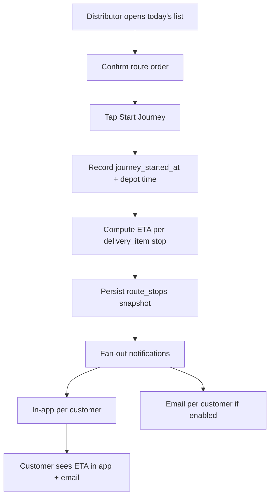
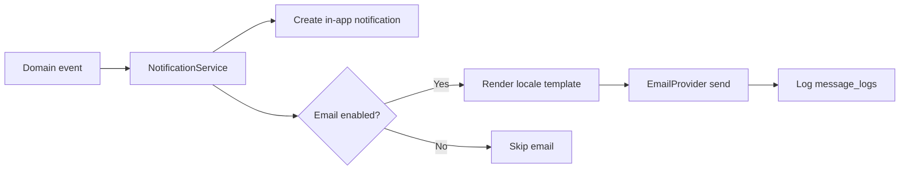

# Phase 2.0 — Delivery Journey ETA & Email Notifications Implementation Plan

**Phase:** 2.0 (extension of Phase 2)  
**Focus:** Distributor “start journey” flow, per-customer estimated arrival times, in-app + email notifications  
**Estimated duration:** 2–3 weeks (Sprint 4 extension or Sprint 4.5)  
**Prerequisite:** Phase 2 complete (delivery lists, delivery status, in-app notification engine)  
**Sources:** Phase 2 plan, Phase 4 route concepts (simplified), product discussion on route ETAs

---

## 1. Phase Objectives

1. Let distributors **start a delivery journey** for a date/slot and notify **all customers on that route** with their **individual estimated arrival time**.
2. Extend the notification engine with **email delivery** for journey-start and existing Phase 2 events (configurable per event type).
3. Show customers a **today’s delivery window** before and during the journey (in-app + email).
4. Keep implementation **lightweight** — static ETA from route order and configurable stop duration (no live GPS; full route optimization remains Phase 4).

## 2. In Scope

| Area | Included |
|------|----------|
| Delivery journey | Start / complete journey per distributor + date + slot |
| Route sequence | Manual stop order (reuse Phase 2 sort) + optional default sequence |
| ETA engine | `estimated_arrival` per stop from journey start time + order × minutes per stop |
| In-app notifications | `delivery_journey_started` to each customer on route with personal ETA |
| Email notifications | Transactional email for journey start + Phase 2 bill/payment events (toggle) |
| Customer UI | “Today’s delivery” card with estimated time window |
| Distributor UI | “Start journey” CTA, journey status, route preview with ETAs |
| Preferences | Customer email opt-in/out; distributor default minutes-per-stop |
| Admin | Email delivery logs, failed send retry queue |

## 3. Out of Scope (Deferred)

- Live GPS tracking and dynamic ETA recalculation (Phase 4+ / enterprise)
- SMS and WhatsApp (Phase 4 messaging expansion)
- Automatic route optimization / map polyline (Phase 4)
- “Arriving in 5–10 minutes” per-stop push (future: `next_stop` action in Phase 2.1 or Phase 4)
- Push notifications / FCM (Phase 5)

---

## 4. Core Flows

### 4.1 Journey Start → Customer ETA Notifications



**Example — Mohan Dairy, 10 customers, morning slot:**

| Stop | Customer | Route order | ETA (start 6:30 AM, 8 min/stop) |
|------|----------|-------------|----------------------------------|
| 1 | Ram | 1 | ~6:38 AM |
| 2 | Shyam | 2 | ~6:46 AM |
| 3 | … | 3 | ~6:54 AM |

Each customer receives: *“Mohan Dairy started delivery. Your milk is expected around **6:46 AM** (±10 min).”*

### 4.2 ETA Calculation (Phase 2.0 — Static)

```
journey_start_at     = timestamp when distributor taps Start Journey (or configured slot start if earlier)
minutes_per_stop     = distributor config (default 8, min 3, max 30)
service_buffer_min   = distributor config (default 2) — added once per stop

For stop at order N (1-based):
  estimated_arrival = journey_start_at
                    + (N - 1) × (minutes_per_stop + service_buffer_min)

estimated_window_start = estimated_arrival - window_buffer_min   (default 5)
estimated_window_end   = estimated_arrival + window_buffer_min   (default 10)
```

Display to customer: **window** (e.g. 6:41–6:56 AM), not a single minute, to reduce complaints when the route slips.

**Recompute rules:**

- ETAs are **fixed at journey start** for Phase 2.0 (no mid-route updates).
- If distributor **restarts journey** same day/slot (journey cancelled then started again), new ETAs issued; customers get updated notification (dedupe by `journey_id`).

### 4.3 Journey Lifecycle

```
planned → in_progress → completed
planned → cancelled (distributor abort before completion)
in_progress → completed (all stops delivered/skipped/failed OR manual Complete Journey)
```

| State | Meaning |
|-------|---------|
| `planned` | List generated; journey not started |
| `in_progress` | Start Journey tapped; ETAs sent |
| `completed` | Route finished for the day/slot |
| `cancelled` | Journey aborted; optional notify customers “delivery delayed today” |

### 4.4 Email Notification Pipeline



**Phase 2.0 email events:**

| Event | Recipient | Default email |
|-------|-----------|---------------|
| `delivery_journey_started` | Customer | On (if email verified) |
| `bill_generated` | Customer | On |
| `payment_recorded` | Customer | On |
| `delivery_failed_skipped` | Customer | On |
| `subscription_activated` | Customer | Off (in-app only) |

Customers can disable **marketing-style** emails; **transactional** bill emails remain on unless account has no verified email.

---

## 5. Module Implementation

### 5.1 Distributor — Journey Controls

| Feature | Detail |
|---------|--------|
| Route preview | Ordered stops with computed ETAs before start |
| Start Journey | Primary CTA when list has pending items |
| Complete Journey | Marks journey done; disables further start |
| Settings | Default `minutes_per_stop`, `window_buffer_min`, optional fixed `slot_start_time` |
| Reorder stops | Drag-and-drop (Phase 2) refreshes preview ETAs |
| Validation | Cannot start if no pending items or journey already `in_progress` |

**Acceptance criteria:**

- Start Journey sends exactly one notification batch per `journey_id`
- ETAs match formula ± timezone display in customer locale
- Audit log: who started journey, at what time, stop count

### 5.2 Customer — Today’s Delivery

| Feature | Detail |
|---------|--------|
| Today card | Distributor name, status (not started / on the way / completed) |
| ETA window | Shown after journey start |
| Deep link | From notification → today’s delivery view |
| History | Past days show planned vs actual (actual = first `delivered` timestamp if recorded) |

### 5.3 Email Integration

| Component | Detail |
|-----------|--------|
| Provider | AWS SES, SendGrid, or Resend (env `EMAIL_PROVIDER`) |
| Templates | HTML + plain text; English + Hindi (nestjs-i18n keys) |
| Variables | `customerName`, `distributorName`, `etaWindow`, `deliveryDate`, `productsSummary` |
| Verification | Send only if `user.email` present and `email_verified_at` set |
| Bounce handling | Mark `email_suppressed_at` on hard bounce; skip future sends |
| Rate limit | Max 1 journey email per customer per journey; batch send async |

**Template: `delivery_journey_started`**

- Subject (EN): `Your milk delivery from {{distributorName}} — expected {{etaWindow}}`
- Subject (HI): `{{distributorName}} से दूध — अनुमानित समय {{etaWindow}}`
- Body: ETA window, address snippet, link to customer dashboard

### 5.4 Admin — Messaging Oversight

| Feature | Detail |
|---------|--------|
| Email log viewer | Filter by status, event, date |
| Resend failed | Admin retry for failed `message_logs` |
| Platform defaults | Global default minutes-per-stop, email toggles per event |

### 5.5 Notifications UI (Extensions)

| Surface | Behavior |
|---------|--------|
| New type filter | `delivery_journey_started` |
| Payload | `journey_id`, `estimated_arrival`, `window_start`, `window_end` |
| Email preference | Customer profile → Notification settings |

---

## 6. Data Model — Phase 2.0 Additions

```
delivery_journeys
  id, distributor_id, delivery_date, slot_id,
  status (planned|in_progress|completed|cancelled),
  started_at, completed_at, started_by_user_id,
  journey_start_at, minutes_per_stop, window_buffer_min,
  created_at, updated_at

delivery_journey_stops
  id, journey_id, delivery_item_id, customer_id,
  stop_order, estimated_arrival, window_start, window_end,
  notification_sent_at

distributor_delivery_settings
  distributor_id (PK),
  default_minutes_per_stop (default 8),
  default_window_buffer_min (default 10),
  use_slot_start_time (bool, default false)

notification_preferences
  user_id, event_type,
  email_enabled (bool), in_app_enabled (bool)

message_logs
  id, user_id, channel (email|sms|whatsapp),
  event_type, template_id, recipient,
  status (queued|sent|failed|bounced),
  provider_ref, error_message, payload_json,
  created_at, sent_at

notifications (extend payload_json)
  -- existing table; add types:
  -- delivery_journey_started, delivery_journey_updated
```

### Indexing

- `delivery_journeys (distributor_id, delivery_date, slot_id)` unique for active journey
- `delivery_journey_stops (journey_id, stop_order)`
- `message_logs (user_id, created_at DESC)`
- `message_logs (status, created_at)` for retry worker

### Idempotency

- Journey start: one active `in_progress` journey per `(distributor_id, delivery_date, slot_id)`
- Notification dedupe key: `(event_type, journey_id, customer_id)`
- Email dedupe key: `(event_type, journey_id, customer_id, channel)`

---

## 7. API Inventory — Phase 2.0

### Delivery Journey (Distributor)

| Method | Endpoint | Description |
|--------|----------|-------------|
| GET | `/api/distributor/delivery-journeys?date=&slotId=` | Journey status + stops + ETAs |
| POST | `/api/distributor/delivery-journeys/preview` | Preview ETAs without starting |
| POST | `/api/distributor/delivery-journeys/start` | Start journey → notify all customers |
| POST | `/api/distributor/delivery-journeys/{id}/complete` | Complete journey |
| POST | `/api/distributor/delivery-journeys/{id}/cancel` | Cancel with optional reason |
| GET/PATCH | `/api/distributor/delivery-settings` | Minutes per stop, buffers |

### Customer

| Method | Endpoint | Description |
|--------|----------|-------------|
| GET | `/api/customers/deliveries/today` | Today’s status + ETA window |
| GET/PATCH | `/api/customers/notification-preferences` | Email / in-app toggles |

### Email / Messaging (Internal)

| Method | Endpoint | Description |
|--------|----------|-------------|
| POST | `/api/internal/messages/send` | Internal dispatch (admin/system) |
| GET | `/api/admin/message-logs` | Email audit log |

### Notifications (extend Phase 2)

Existing `/api/notifications` returns new event types; no contract break.

---

## 8. Background Jobs

| Job | Schedule | Action |
|-----|----------|--------|
| `process_email_queue` | Every 1 min | Send queued `message_logs` |
| `retry_failed_emails` | Every 15 min | Retry transient failures (max 3) |
| `expire_stale_journeys` | Daily 23:00 | Auto-complete journeys still `in_progress` from past dates |

Journey notifications are **synchronous on Start Journey** for in-app; email enqueued async to keep API < 2s for 50 stops.

---

## 9. Sprint Breakdown (2–3 Weeks)

### Week 1 — Backend

| Deliverable |
|-------------|
| Schema: journeys, stops, settings, message_logs, preferences |
| ETA calculation service + unit tests |
| Start / complete / cancel journey APIs |
| Notification fan-out + dedupe |

### Week 2 — Email + Frontend

| Deliverable |
|-------------|
| Email provider adapter + templates (EN/HI) |
| Email queue worker + message_logs |
| Distributor: Start Journey UI + ETA preview |
| Customer: Today’s delivery card + notification deep link |

### Week 3 — Polish + UAT

| Deliverable |
|-------------|
| Notification preferences UI |
| Bill/payment email wiring (Phase 2 events) |
| Admin email log viewer |
| E2E: 10-customer route journey + email receipt |
| Load test: 100 stops journey start < 3s API (email async) |

---

## 10. User Stories & Acceptance Criteria

| ID | Story | Acceptance criteria |
|----|-------|---------------------|
| US-2.0-1 | As a distributor, I start my morning journey | All customers on route get in-app notification with personal ETA window |
| US-2.0-2 | As Ram, I know when milk arrives | Today view shows ~6:38 AM window after Mohan starts journey |
| US-2.0-3 | As a customer, I receive email when journey starts | Email arrives if verified + preference on; contains ETA window + link |
| US-2.0-4 | As a distributor, I reorder stops before start | Preview ETAs update; start uses new order |
| US-2.0-5 | As a customer, I opt out of journey emails | No email on start; in-app still works |
| US-2.0-6 | As a customer, I get bill email when cycle closes | Email sent with bill summary (Phase 2 event extended) |
| US-2.0-7 | As admin, I see failed emails | message_logs shows failures; retry works |

---

## 11. QA Test Plan

| Suite | Cases |
|-------|-------|
| ETA math | 1/10/50 stops; custom minutes_per_stop; TZ boundaries |
| Journey state | Double start rejected; complete/cancel transitions |
| Notifications | One per customer per journey; dedupe on retry |
| Email | Verified vs unverified; opt-out; bounce suppression |
| i18n | Hindi template renders correct ETA format |
| E2E | Mohan Dairy 10-customer route; all in-app + email |
| Regression | Phase 2 billing/delivery flows unchanged |

---

## 12. Non-Functional Requirements

- Journey start API p95 < 2s for up to 50 stops (email async)
- Email delivery at-least-once; idempotent via dedupe keys
- No PII in application logs beyond user id
- Email templates responsive (mobile-readable)
- `decimal` not used for time; store UTC timestamps; display in user/distributor TZ
- Secrets: `EMAIL_API_KEY`, `EMAIL_FROM` via environment only

---

## 13. Environment Configuration

```env
EMAIL_PROVIDER=ses|sendgrid|resend
EMAIL_FROM=noreply@yourdomain.com
EMAIL_FROM_NAME=Milk Distribution
EMAIL_REPLY_TO=support@yourdomain.com
EMAIL_QUEUE_ENABLED=true
JOURNEY_DEFAULT_MINUTES_PER_STOP=8
JOURNEY_DEFAULT_WINDOW_BUFFER_MIN=10
```

---

## 14. Phase 2.0 Exit Criteria

- [ ] Distributor can Start Journey and see per-stop ETA preview
- [ ] All route customers receive in-app notification with personal ETA window
- [ ] Verified customers receive journey-start email (EN/HI)
- [ ] Customer “today’s delivery” shows journey status and ETA
- [ ] Bill generated / payment recorded emails wired (configurable)
- [ ] message_logs + admin viewer operational
- [ ] Notification preferences respected
- [ ] Pilot distributor (e.g. Mohan Dairy-scale route) UAT sign-off

---

## 15. Handoff to Phase 3 & Phase 4

**Phase 3** can add:
- PWA push notifications alongside email
- OTP phone as alternate contact for delivery alerts

**Phase 4** can replace static ETA with:
- `optimize_routes` nightly job
- Map view, distance-based ETAs
- SMS/WhatsApp for journey start and delays
- Optional `next_stop` → “arriving in 10 minutes” alert

Freeze before Phase 3:
- `delivery_journeys`, `delivery_journey_stops`, `message_logs` schemas
- `delivery_journey_started` notification payload shape

---

## 16. Relationship to Phase 2

| Phase 2 capability | Phase 2.0 extension |
|--------------------|---------------------|
| Manual route sort | Feeds stop order for ETA |
| In-app notifications | Adds journey event + email channel |
| Email stubs | First real email integration |
| Delivery list UI | Adds Start Journey workflow |

Update [PHASE_2_Delivery_Billing_Notifications.md](./PHASE_2_Delivery_Billing_Notifications.md) §3 when Phase 2.0 ships: move “Email channels” from deferred to delivered in 2.0 for transactional events.
