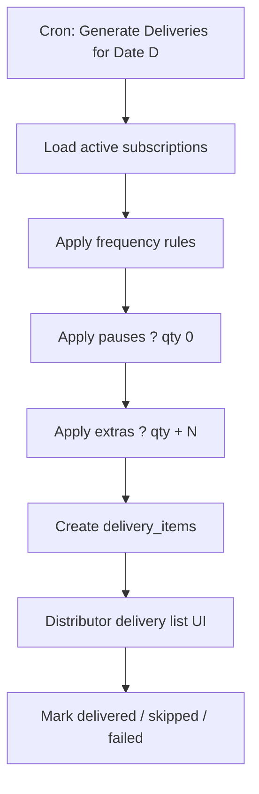
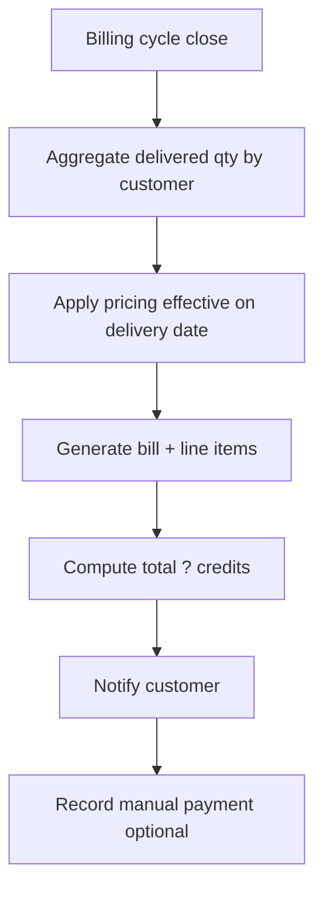

# Phase 2 � Delivery, Billing & Notifications Implementation Plan

**Phase:** 2 of 5  
**Focus:** Delivery list generation, billing automation, in-app notification engine  
**Estimated duration:** 6�8 weeks (Sprints 3�4)  
**Prerequisite:** Phase 1 complete (subscriptions, pauses, extras, go-live distributors)  
**Implementation checklist:** [PHASE_2_Checklist.md](./PHASE_2_Checklist.md)  
**Sources:** PRD v2/v3/v6, Product Bible v4/v5, Implementation Guide v7, Execution Book v8

---

## 1. Phase Objectives

1. Generate accurate **daily delivery lists** from active subscriptions with pause/extra adjustments.
2. Automate **usage-based billing** from delivery records.
3. Launch **in-app notification engine** for distributor ? customer and admin ? distributor events.
4. Complete end-to-end flow: subscribe ? deliver ? bill (manual payment recording OK).

## 2. In Scope

| Area | Included |
|------|----------|
| Delivery engine | Nightly/on-demand list generation, delivery status tracking |
| Pause/extra application | Apply Phase 1 requests to delivery quantities |
| Billing engine | Cycle-based invoices, line items, dues tracking |
| Manual payments | Record cash/UPI/offline payments against bills |
| Notifications | In-app feed, read/unread, event-driven triggers |
| Admin oversight | Delivery and billing monitoring dashboards |

## 3. Out of Scope (Deferred)

- Payment gateway / online checkout (Phase 3)
- Wallet balances (Phase 3)
- SMS, WhatsApp, Email channels (architecture-ready stubs only)
- Route optimization (Phase 4)
- Delivery staff mobile app (Phase 3+)

---

## 4. Core Flows

### 4.1 Daily Delivery Pipeline



**Generation formula (Execution Book v8):**

```
daily_delivery_qty = base_subscription_qty
                   ? pause_adjustment
                   + extra_adjustment
```

Skip rows where final qty = 0.

### 4.2 Billing Pipeline



**Billing formula:**

```
line_total = delivered_quantity � unit_price_at_delivery_date
bill_total = ?(line_totals) + adjustments ? credits
```

Pauses reduce delivered qty; extras increase it. No delivery ? no charge for that day/product.

### 4.3 Notification Events (Phase 2 � In-App)

| Event | Recipient | Trigger |
|-------|-----------|---------|
| Subscription activated | Customer, Distributor | New subscription |
| Pause approved/auto-applied | Distributor | Pause within cutoff |
| Extra milk request | Distributor | Customer submits extra |
| Bill generated | Customer | Cycle close |
| Payment recorded | Customer | Distributor marks paid |
| Distributor approved | Distributor | Admin action |
| Delivery failed/skipped | Customer | Distributor updates status |

---

## 5. Module Implementation

### 5.1 Distributor � Delivery List

| Feature | Detail |
|---------|--------|
| Daily list view | Filter by date, slot, route order (manual sort Phase 2) |
| Row detail | Customer, address, products, qty, phone |
| Status update | Delivered, skipped (with reason), failed |
| Bulk actions | Mark all delivered for slot |
| Export | CSV/PDF print-friendly list |

**Acceptance criteria:**
- List for date D matches subscription engine output � manual overrides logged
- Status change immutable audit entry
- Regeneration idempotent (no duplicate rows for same sub+date+product)

### 5.2 Distributor � Billing

| Feature | Detail |
|---------|--------|
| Billing cycles | Weekly/bi-weekly/monthly per distributor config |
| Invoice list | Filter by customer, status (draft, issued, paid, overdue) |
| Record payment | Amount, method, reference, date |
| Adjustments | Manual credit/debit with reason (admin approval optional) |
| Dues report | Outstanding by customer |

### 5.3 Customer � Billing

| Feature | Detail |
|---------|--------|
| Bill history | List + detail with line items |
| Delivery breakdown | Link bill lines to delivery dates |
| Due amount | Running balance |
| Download | PDF invoice |

### 5.4 Admin � Operations

| Feature | Detail |
|---------|--------|
| Deliveries monitor | Platform-wide delivery success rate |
| Billing oversight | Total billed, collected, outstanding |
| Exception queue | Failed deliveries, negative adjustments |

### 5.5 Notifications UI

| Surface | Behavior |
|---------|----------|
| Bell icon + badge | Unread count |
| Notification center | Paginated, mark read, filter by type |
| Deep links | Navigate to bill, subscription, delivery |

---

## 6. Delivery Engine � Detailed Rules

### 6.1 Schedule Resolution

For delivery date `D`, include subscription if:
1. `subscription.status = active`
2. Frequency rule matches `D`
3. `D >= subscription.start_date`
4. Not fully paused for `D`

### 6.2 Pause Application

| Pause type | Effect on date D |
|------------|------------------|
| Full day pause | qty = 0, row optional (config: hide vs show skipped) |
| Partial pause | Not in MVP � full day only Phase 2 |

**Cutoff enforcement:** Reject pause API if now > distributor cutoff for target date (Phase 1 API extended with delivery impact).

### 6.3 Extra Milk Application

- Extra record with `date = D` adds `extra_quantity` to base qty for that date only
- Multiple extras same day ? sum quantities

### 6.4 Delivery Status State Machine

```
pending ? delivered
pending ? skipped (reason required)
pending ? failed (reason required)
delivered ? [no revert without admin override]
```

---

## 7. Billing Engine � Detailed Rules

### 7.1 Billing Cycles

| Cycle | Close trigger |
|-------|---------------|
| Weekly | Sunday 11:59 PM distributor TZ |
| Bi-weekly | Configurable anchor day |
| Monthly | Last day of month |

### 7.2 Invoice States

```
draft ? issued ? partially_paid ? paid
issued ? overdue (auto after due_date)
issued ? void (admin/distributor with reason)
```

### 7.3 Pricing at Delivery

Use `pricing` row effective on delivery date (supports price changes mid-cycle).

### 7.4 Manual Payments

```
payments
  id, bill_id, amount, method (cash|upi|bank|other),
  reference, recorded_by, recorded_at
```

Partial payments allowed; bill status updates accordingly.

---

## 8. Data Model � Phase 2 Additions

```
deliveries
  id, distributor_id, delivery_date, slot_id, status, generated_at

delivery_items
  id, delivery_id, subscription_id, customer_id, product_id,
  planned_qty, delivered_qty, status, notes

bills
  id, distributor_id, customer_id, cycle_start, cycle_end,
  subtotal, adjustments, total, amount_paid, status, due_date, issued_at

bill_line_items
  id, bill_id, product_id, delivery_date, quantity,
  unit_price, line_total, delivery_item_id

payments
  id, bill_id, amount, method, reference, recorded_by, created_at

bill_adjustments
  id, bill_id, type (credit|debit), amount, reason, created_by

notifications
  id, user_id, type, title, body, payload_json,
  read_at, created_at
```

### Indexing

- `delivery_items (delivery_date, distributor_id)` via join
- `bills (customer_id, status)`
- `notifications (user_id, read_at, created_at DESC)`

---

## 9. API Inventory � Phase 2

### Delivery

| Method | Endpoint | Description |
|--------|----------|-------------|
| POST | `/api/distributor/deliveries/generate` | Generate for date (also cron) |
| GET | `/api/distributor/deliveries?date=` | Daily list |
| PATCH | `/api/distributor/delivery-items/{id}` | Update status/qty |
| GET | `/api/customers/deliveries?from=&to=` | Customer delivery history |

### Billing

| Method | Endpoint | Description |
|--------|----------|-------------|
| POST | `/api/distributor/billing/run-cycle` | Close cycle + issue bills |
| GET | `/api/distributor/bills` | List bills |
| GET | `/api/distributor/bills/{id}` | Detail + lines |
| POST | `/api/distributor/bills/{id}/payments` | Record payment |
| GET | `/api/customers/bills` | Customer bill history |
| GET | `/api/customers/bills/{id}/pdf` | Download invoice |

### Notifications

| Method | Endpoint | Description |
|--------|----------|-------------|
| GET | `/api/notifications` | Paginated feed |
| PATCH | `/api/notifications/{id}/read` | Mark read |
| POST | `/api/notifications/mark-all-read` | Bulk read |

### Admin

| Method | Endpoint | Description |
|--------|----------|-------------|
| GET | `/api/admin/operations/deliveries` | Platform delivery stats |
| GET | `/api/admin/operations/billing` | Platform billing stats |

---

## 10. Background Jobs

| Job | Schedule | Action |
|-----|----------|--------|
| `generate_daily_deliveries` | Daily 00:30 distributor TZ | Create delivery + items |
| `close_billing_cycles` | Per distributor cycle config | Issue bills |
| `mark_overdue_bills` | Daily 06:00 | Status ? overdue |
| `delivery_reminder_notifications` | Daily 07:00 | Notify distributors of today's list |

Use idempotency keys: `(distributor_id, delivery_date, subscription_id, product_id)`.

---

## 11. Sprint Breakdown

### Sprint 3 (Weeks 1�4) � Delivery

| Week | Deliverables |
|------|--------------|
| 1 | Delivery schema, generation algorithm, unit tests per frequency |
| 2 | Pause/extra integration tests, cron job |
| 3 | Distributor delivery list UI + status updates |
| 4 | Customer delivery history, admin monitor |

### Sprint 4 (Weeks 5�8) � Billing + Notifications

| Week | Deliverables |
|------|--------------|
| 5 | Billing cycle engine, line item aggregation |
| 6 | Invoice UI (distributor + customer), PDF export |
| 7 | Manual payment recording, dues reports |
| 8 | Notification service + UI, event wiring, UAT |

---

## 12. User Stories & Acceptance Criteria

| ID | Story | Acceptance criteria |
|----|-------|---------------------|
| US-7 | As a distributor, I see today's delivery list | Matches subscriptions ? pauses + extras |
| US-8 | As a distributor, I mark deliveries delivered | Billable qty updated |
| US-9 | As a customer, I pause before cutoff | Delivery qty zero; not billed |
| US-10 | As a customer, I receive monthly bill | Line items match delivered qty � price |
| US-11 | As a distributor, I record cash payment | Bill balance reduces; customer notified |
| US-12 | As a customer, I see in-app notification on new bill | Unread badge increments |

---

## 13. QA Test Plan � Phase 2

| Suite | Cases |
|-------|-------|
| Delivery generation | Each frequency, month boundaries, leap years |
| Pause/extra | Combinations on same date |
| Idempotency | Double cron run ? no duplicates |
| Billing | Price change mid-cycle, partial payments |
| Zero delivery | Paused week ? zero or reduced bill |
| Notifications | Each event type fires once |
| E2E | Path A + Path B customer through bill payment |
| Load | 10k subscriptions nightly generation < 15 min |

---

## 14. Non-Functional Requirements

- Delivery generation recoverable on failure (job checkpointing)
- Billing amounts use decimal(10,2) � no float
- Invoice PDF generation async for large bills
- Notification delivery at-least-once; dedupe by event id

---

## 15. Phase 2 Exit Criteria

- [ ] Daily delivery lists generated automatically for all active distributors
- [ ] Pause and extra requests correctly alter delivery quantities
- [ ] Billing cycles produce accurate invoices from delivery records
- [ ] Manual payments update bill status
- [ ] In-app notifications for all Phase 2 events
- [ ] Admin operations dashboard live
- [ ] Beta release with 1�2 pilot distributors
- [ ] Product Document v1 milestone: "Complete end-to-end testing of Delivery and Billing" ?

---

## 16. Handoff to Phase 3

Phase 2 establishes **bills with outstanding balances**. Phase 3 adds:
- Online payment gateway settlement against `bills`
- Wallet prepay and auto-deduct
- OTP login for customer mobile UX

Freeze `bills.total`, `payments`, and `delivery_items.delivered_qty` schemas before Phase 3.
