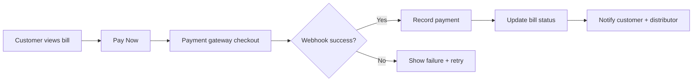
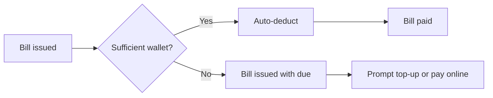

# Phase 3 — Payments, Wallets & Mobile Experience Implementation Plan

**Phase:** 3 of 5  
**Focus:** Payment gateway, wallet system, OTP login, mobile-optimized UX  
**Estimated duration:** 6–8 weeks (Sprint 5 + extensions)  
**Prerequisite:** Phase 2 complete (bills, manual payments, notifications)  
**Sources:** Master PRD v3, Product Bible v5, Enterprise PRD v6, Product Document v1 milestones

---

## 1. Phase Objectives

1. Enable **online bill payment** via Indian payment gateway (Razorpay / PayU / Cashfree — TBD).
2. Introduce **customer and distributor wallets** for prepay and auto-settlement.
3. Ship **OTP-based login** (phone) alongside existing email/password.
4. Deliver **mobile-responsive** customer and distributor experiences (PWA baseline).
5. Reduce collection friction and improve cash-flow for distributors.

## 2. In Scope

| Area | Included |
|------|----------|
| Payment gateway | Pay bill online, webhook confirmation, reconciliation |
| Wallets | Top-up, balance, auto-deduct on bill issue |
| OTP auth | SMS OTP send/verify, phone as primary identifier option |
| PWA / mobile UX | Responsive layouts, touch-friendly flows, optional install prompt |
| Payment history | Unified online + manual payment ledger |
| Distributor collections | View online vs offline collections, settlement reports |
| Notification hooks | Payment success/failure, low wallet balance |

## 3. Out of Scope (Deferred)

- Native iOS/Android apps (Phase 3 delivers PWA; native in Phase 4 optional)
- WhatsApp payment reminders (Phase 4 messaging expansion)
- Multi-currency
- Distributor SaaS subscription billing to platform (separate billing track — plan in Phase 4)

---

## 4. Core Flows

### 4.1 Online Bill Payment



### 4.2 Wallet Auto-Deduct



### 4.3 OTP Login

```
Customer enters phone ? OTP sent via SMS provider ? Verify ? Issue JWT
Optional: link phone to existing email account
```

---

## 5. Module Implementation

### 5.1 Customer — Payments

| Feature | Detail |
|---------|--------|
| Pay bill | Full or partial online payment |
| Wallet top-up | Fixed denominations + custom amount |
| Auto-pay toggle | Use wallet first on bill issue |
| Receipt | Email/PDF receipt on success (in-app minimum) |
| Saved methods | Tokenized UPI/card if gateway supports |

### 5.2 Customer — Mobile UX

| Screen | Mobile optimization |
|--------|---------------------|
| Find Distributor | Map-first, radius chips (1/3/5/10 km) |
| Subscription | Swipe actions for pause/extra |
| Bills | Sticky pay CTA, UPI deep link |
| Notifications | Pull-to-refresh |

### 5.3 Distributor — Collections

| Feature | Detail |
|---------|--------|
| Collections dashboard | Online vs cash split |
| Settlement report | Gateway settlements by date |
| Manual payment | Retained from Phase 2 |
| Wallet view | Customer wallet balances (read-only) |

### 5.4 Platform — Payment Admin

| Feature | Detail |
|---------|--------|
| Gateway config | Keys per environment, webhook secrets |
| Reconciliation | Match gateway orders to `payments` |
| Failed payment queue | Retry / support workflow |

---

## 6. Payment & Wallet Rules

### 6.1 Payment Gateway

| Rule | Detail |
|------|--------|
| Idempotency | `order_id` unique per bill attempt |
| Webhook verification | HMAC signature required |
| Amount mismatch | Reject webhook; alert ops |
| Partial pay | Allowed if gateway + bill logic support |
| Refunds | Admin-initiated; credit wallet or gateway refund |

### 6.2 Wallet

| Rule | Detail |
|------|--------|
| Balance | Non-negative; top-up increases, deduct decreases |
| Hold | Optional hold during checkout (prevent double spend) |
| Ledger | Append-only `wallet_transactions` |
| Scope | Per customer per distributor (multi-tenant wallet) |

### 6.3 OTP

| Rule | Detail |
|------|--------|
| Rate limit | Max 3 OTPs per phone per 15 min |
| Expiry | 5 minutes |
| Lockout | 5 failed attempts ? 30 min lock |

---

## 7. Data Model — Phase 3 Additions

```
payment_orders
  id, bill_id, gateway, gateway_order_id, amount,
  status (created|pending|success|failed), created_at

wallet_accounts
  id, customer_id, distributor_id, balance, currency

wallet_transactions
  id, wallet_id, type (topup|deduct|refund|adjustment),
  amount, balance_after, reference_type, reference_id, created_at

otp_requests
  id, phone, code_hash, expires_at, verified_at, attempts

payment_methods          -- optional tokenized
  id, customer_id, gateway_token, type, last4, active
```

Extend `payments`:
- `source`: manual | gateway | wallet
- `payment_order_id`, `wallet_transaction_id` nullable FKs

---

## 8. API Inventory — Phase 3

### Payments

| Method | Endpoint | Description |
|--------|----------|-------------|
| POST | `/api/customers/bills/{id}/pay` | Initiate gateway checkout |
| POST | `/api/webhooks/payments/{gateway}` | Webhook handler |
| GET | `/api/customers/payments` | Payment history |

### Wallet

| Method | Endpoint | Description |
|--------|----------|-------------|
| GET | `/api/customers/wallet` | Balance + recent transactions |
| POST | `/api/customers/wallet/topup` | Initiate top-up order |
| PATCH | `/api/customers/wallet/settings` | Auto-pay toggle |

### OTP Auth

| Method | Endpoint | Description |
|--------|----------|-------------|
| POST | `/api/auth/otp/send` | Send OTP to phone |
| POST | `/api/auth/otp/verify` | Verify + login/register |

### Distributor

| Method | Endpoint | Description |
|--------|----------|-------------|
| GET | `/api/distributor/collections` | Collections summary |
| GET | `/api/distributor/settlements` | Gateway settlement report |

---

## 9. Integrations

| Integration | Purpose | Phase 3 scope |
|-------------|---------|---------------|
| Payment gateway | Bill pay, wallet top-up | Required |
| SMS provider | OTP delivery | Required |
| Email provider | Receipts | Optional |
| WhatsApp Business API | Payment reminders | Stub only |

**Environment variables:** gateway keys, webhook secrets, SMS API key — never in repo.

---

## 10. Sprint Breakdown

### Sprint 5 (Weeks 1–4) — Payments Core

| Week | Deliverables |
|------|--------------|
| 1 | Gateway sandbox integration, `payment_orders` schema |
| 2 | Pay bill flow + webhook handler + reconciliation job |
| 3 | Payment history UI, distributor collections view |
| 4 | Security review: webhook, amount tampering tests |

### Sprint 6 (Weeks 5–8) — Wallet + OTP + Mobile

| Week | Deliverables |
|------|--------------|
| 5 | Wallet schema, top-up, ledger |
| 6 | Auto-deduct on bill issue, low balance notifications |
| 7 | OTP auth flow, phone registration path |
| 8 | PWA polish, mobile QA, pilot payment UAT |

---

## 11. User Stories & Acceptance Criteria

| ID | Story | Acceptance criteria |
|----|-------|---------------------|
| US-13 | As a customer, I pay my bill online via UPI | Bill marked paid on webhook success |
| US-14 | As a customer, I top up wallet and auto-pay bills | Bill auto-settles when balance sufficient |
| US-15 | As a customer, I login with phone OTP | OTP verified; JWT issued |
| US-16 | As a distributor, I see online vs cash collections | Dashboard matches payment records |
| US-17 | As a customer on mobile, I find nearby distributor | Radius filter usable on 375px viewport |

---

## 12. QA Test Plan — Phase 3

| Suite | Cases |
|-------|-------|
| Gateway | Success, failure, timeout, duplicate webhook |
| Wallet | Top-up, deduct, insufficient balance, concurrency |
| OTP | Expired, wrong code, rate limit |
| Reconciliation | Gateway report vs DB totals |
| Mobile | Discovery, pay flow on iOS Safari + Android Chrome |
| Security | Webhook signature bypass, amount manipulation |

---

## 13. Compliance & Security

- PCI: No raw card storage — use gateway tokenization only
- UPI intent flows per NPCI guidelines
- PII: Phone numbers encrypted at rest (recommended)
- Audit: All wallet mutations logged

---

## 14. Phase 3 Exit Criteria

- [ ] Customers pay bills online with confirmed webhook reconciliation
- [ ] Wallet top-up and auto-deduct functional
- [ ] OTP login available for customers
- [ ] Mobile-responsive UX for discovery, subscription, billing, pay
- [ ] Distributor collections dashboard accurate
- [ ] Product Document v1 milestones: OTP login UI ?, payment gateway ?, wallet ?
- [ ] Pilot distributors accepting online payments

---

## 15. Handoff to Phase 4

Phase 3 produces **payment and wallet transaction history** — input for analytics and loyalty points. Ensure:
- `wallet_transactions` immutable
- `payments.source` enum stable
- Event stream or export ready for analytics pipeline
