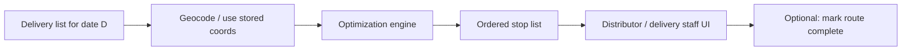

# Phase 4 — Analytics, Route Optimization & Loyalty Implementation Plan

**Phase:** 4 of 5  
**Focus:** Operational analytics, delivery route optimization, loyalty programs, messaging expansion  
**Estimated duration:** 8–10 weeks  
**Prerequisite:** Phase 3 complete (payments, sufficient delivery/billing history)  
**Sources:** PRD v2/v6, Product Bible v5, Master PRD v3, Enterprise Execution Book v8

---

## 1. Phase Objectives

1. Provide **actionable analytics** for admin, distributors, and customers.
2. Reduce delivery cost and time via **route optimization** foundation.
3. Launch **loyalty program** to improve retention and reduce churn.
4. Expand notifications to **SMS and WhatsApp** (email optional).
5. Optional: **native mobile apps** or enhanced PWA if pilot feedback demands.

## 2. In Scope

| Area | Included |
|------|----------|
| Admin analytics | Platform KPIs, cohort trends, churn, revenue |
| Distributor analytics | Delivery success, collections, customer LTV, product mix |
| Customer insights | Spend history, delivery reliability score |
| Route optimization | Stop ordering, distance/time estimates, map view |
| Loyalty | Points accrual, redemption rules, tier basics |
| Messaging | SMS + WhatsApp templates for key events |
| SaaS billing | Platform subscription plans for distributors (MRR) |
| Advanced reporting | Export CSV, scheduled email reports |

## 3. Out of Scope (Deferred)

- ML demand forecasting
- Full fleet management / GPS live tracking
- Marketplace commissions across distributors
- IoT integrations (Phase 5)

---

## 4. Core Flows

### 4.1 Route Optimization (Daily)



**MVP algorithm:** Nearest-neighbor or OR-Tools TSP heuristic starting from distributor depot.

### 4.2 Loyalty Accrual

```
On bill paid ? accrue points (configurable rate)
On N consecutive delivery weeks ? bonus points
Redeem points ? wallet credit or bill discount
```

### 4.3 Analytics Pipeline

```
Operational DB ? nightly ETL ? analytics tables / warehouse
Dashboards query pre-aggregated metrics (not raw scans)
```

---

## 5. Module Implementation

### 5.1 Admin Analytics Dashboard

| Metric | Definition |
|--------|------------|
| Active subscriptions | Count status=active |
| GMV | Sum delivered qty × price (platform-wide) |
| Collection rate | paid / issued bill totals |
| Distributor growth | New go-live per month |
| Churn | Subscriptions cancelled / paused > 30 days |
| Onboarding mix | self_service vs distributor_led ratio |

**Visualizations:** time series, top distributors, geographic heat map (city level).

### 5.2 Distributor Analytics

| Report | Detail |
|--------|--------|
| Delivery performance | Success vs skipped vs failed % |
| Revenue | Billed vs collected by week |
| Customer retention | Active customers, new, lost |
| Product mix | Volume by SKU / fat % |
| Route efficiency | km per delivery, time per stop (estimated) |

### 5.3 Route Optimization UI

| Feature | Detail |
|---------|--------|
| Map view | Stops numbered, route polyline |
| Reorder | Manual drag override optimization |
| Print route sheet | Ordered list with addresses |
| Depot config | Start/end location on distributor profile |

### 5.4 Loyalty Program

| Component | Detail |
|-----------|--------|
| Program config | Per distributor: points per ? spent |
| Customer wallet | Loyalty points balance separate from cash wallet |
| Redemption | Min points, conversion rate to ? credit |
| Tiers | Bronze/Silver/Gold by lifetime spend (optional) |
| Admin | Platform default templates; distributor override |

### 5.5 Messaging Expansion

| Channel | Events |
|---------|--------|
| SMS | OTP (Phase 3), bill due reminder, delivery delay |
| WhatsApp | Bill issued, payment receipt, pause confirmation |
| Email | Monthly statement, admin reports |

Use template IDs; respect DND/TRAI regulations for SMS.

### 5.6 Platform SaaS Billing (Distributors)

| Feature | Detail |
|---------|--------|
| Plans | Free trial, Basic, Pro, Enterprise |
| Billing | Monthly platform invoice to distributor |
| Enforcement | Feature flags by plan (e.g. analytics Pro-only) |

---

## 6. Data Model — Phase 4 Additions

```
analytics_daily_metrics
  date, distributor_id, metric_key, metric_value

routes
  id, distributor_id, delivery_date, depot_lat, depot_lng,
  total_distance_km, estimated_duration_min, optimized_at

route_stops
  id, route_id, delivery_item_id, stop_order,
  lat, lng, estimated_arrival

loyalty_accounts
  id, customer_id, distributor_id, points_balance, tier

loyalty_transactions
  id, loyalty_account_id, type (earn|redeem|expire|adjust),
  points, reference_type, reference_id, created_at

loyalty_programs
  id, distributor_id, points_per_rupee, redemption_rate,
  min_redeem_points, active

message_logs
  id, user_id, channel (sms|whatsapp|email), template_id,
  status, provider_ref, created_at

saas_plans
  id, name, price_monthly, feature_flags_json

distributor_subscriptions
  id, distributor_id, plan_id, status, current_period_end
```

---

## 7. API Inventory — Phase 4

### Analytics

| Method | Endpoint | Description |
|--------|----------|-------------|
| GET | `/api/admin/analytics/overview` | Platform KPIs |
| GET | `/api/distributor/analytics/dashboard` | Distributor metrics |
| GET | `/api/distributor/analytics/export` | CSV export |

### Routes

| Method | Endpoint | Description |
|--------|----------|-------------|
| POST | `/api/distributor/routes/optimize` | Generate route for date |
| GET | `/api/distributor/routes?date=` | Route + stops |
| PATCH | `/api/distributor/routes/{id}/stops/reorder` | Manual override |

### Loyalty

| Method | Endpoint | Description |
|--------|----------|-------------|
| GET | `/api/customers/loyalty` | Points balance + history |
| POST | `/api/customers/loyalty/redeem` | Redeem to wallet/discount |
| CRUD | `/api/distributor/loyalty/program` | Configure program |

### Messaging

| Method | Endpoint | Description |
|--------|----------|-------------|
| POST | `/api/internal/messages/send` | Internal dispatch |
| GET | `/api/admin/messages/logs` | Delivery audit |

---

## 8. Background Jobs

| Job | Schedule | Action |
|-----|----------|--------|
| `aggregate_analytics` | Nightly | Roll up delivery/billing/payment metrics |
| `optimize_routes` | Daily 01:00 | Pre-compute routes before delivery |
| `loyalty_accrual` | On payment webhook | Earn points |
| `loyalty_expiry` | Monthly | Expire stale points per policy |
| `bill_reminder_sms` | 2 days before due | SMS/WhatsApp |
| `saas_invoice_distributors` | Monthly | Platform billing |

---

## 9. Sprint Breakdown

### Sprint 7 (Weeks 1–4) — Analytics

| Week | Deliverables |
|------|--------------|
| 1 | ETL pipeline, `analytics_daily_metrics` |
| 2 | Admin analytics dashboard |
| 3 | Distributor analytics + exports |
| 4 | Onboarding mix, churn, collection KPIs |

### Sprint 8 (Weeks 5–8) — Routes + Loyalty

| Week | Deliverables |
|------|--------------|
| 5 | Route optimization service + map UI |
| 6 | Manual reorder, route sheet print |
| 7 | Loyalty program config + accrual on payment |
| 8 | Redemption flow, tier display |

### Sprint 9 (Weeks 9–10) — Messaging + SaaS Billing

| Week | Deliverables |
|------|--------------|
| 9 | SMS/WhatsApp integration, template management |
| 10 | Distributor SaaS plans, UAT, production rollout prep |

---

## 10. User Stories & Acceptance Criteria

| ID | Story | Acceptance criteria |
|----|-------|---------------------|
| US-18 | As a distributor, I see optimized delivery route | Stops ordered; map displays route |
| US-19 | As a distributor, I view weekly revenue report | Matches billing/payment data ±1% |
| US-20 | As a customer, I earn points on paid bills | Points credited within 1 min of payment |
| US-21 | As a customer, I redeem points for bill credit | Wallet or next bill discount applied |
| US-22 | As admin, I see platform churn trends | 30-day rolling churn computed |
| US-23 | As a customer, I get WhatsApp bill reminder | Message logged; template compliant |

---

## 11. QA Test Plan — Phase 4

| Suite | Cases |
|-------|-------|
| Analytics | Metric accuracy vs raw SQL spot checks |
| Routes | 50+ stops performance; manual reorder persists |
| Loyalty | Earn, redeem, insufficient points, expiry |
| Messaging | SMS/WhatsApp sandbox delivery |
| SaaS billing | Plan downgrade feature restriction |
| Regression | Phases 1–3 E2E still pass |

---

## 12. Non-Functional Requirements

- Analytics queries p95 < 2s on 12 months data
- Route optimization < 30s for 200 stops
- Message delivery retry with exponential backoff
- Analytics data retention: 24 months hot, archive beyond

---

## 13. Phase 4 Exit Criteria

- [ ] Admin and distributor analytics dashboards live
- [ ] Route optimization used by pilot distributors
- [ ] Loyalty earn/redeem functional
- [ ] SMS + WhatsApp notifications for bill/delivery events
- [ ] Distributor SaaS plan enforcement active
- [ ] Product Bible v5 Phase 4 milestones ?
- [ ] Production rollout expanded beyond pilot cities

---

## 14. Handoff to Phase 5

Phase 4 generates **rich operational telemetry** and **route/stop data** — foundation for IoT (cold chain, smart dispensers) and enterprise ERP integrations. Document public API versioning before Phase 5 partner integrations.
