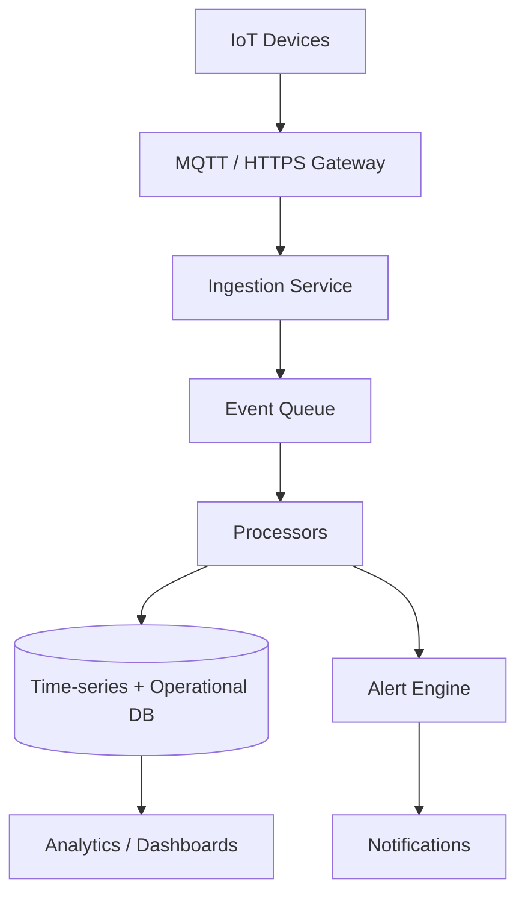

# Phase 5 — IoT, Enterprise Integrations & Scale Implementation Plan

**Phase:** 5 of 5  
**Focus:** IoT dairy ecosystem, smart devices, enterprise integrations, platform scale  
**Estimated duration:** 12+ weeks (ongoing program)  
**Prerequisite:** Phase 4 complete (analytics, routes, loyalty, messaging)  
**Sources:** Enterprise PRD v6, Product Bible v5, Master PRD v3, Execution Book v8 future roadmap

---

## 1. Phase Objectives

1. Integrate **IoT devices** for milk collection, quality, cold chain, and smart dispensing.
2. Enable **enterprise integrations** (ERP, accounting, CRM, webhooks).
3. Scale platform for **multi-city, multi-region** operations with SLA guarantees.
4. Deliver **native mobile apps** if not completed in Phase 4.
5. Establish **marketplace and partner ecosystem** foundations.

## 2. In Scope

| Area | Included |
|------|----------|
| IoT ingestion | Device registration, telemetry pipeline, alerts |
| Smart dairy | Collection volume sensors, fat testing devices, temperature monitors |
| Enterprise API | Webhooks, API keys, rate limits, partner documentation |
| ERP connectors | Tally, Zoho Books, QuickBooks (prioritize by customer demand) |
| Multi-region | Data residency considerations, CDN, regional deployments |
| Native mobile | iOS + Android apps (customer + distributor lite) |
| Advanced automation | Vacation mode, custom subscription schedules |
| Delivery staff app | Route execution, proof of delivery, GPS optional |
| Platform scale | Read replicas, caching, sharding strategy |

## 3. Out of Scope (Initial Phase 5 Wave)

- Full autonomous delivery (drones, robots)
- Blockchain traceability (unless regulatory requirement emerges)
- International expansion beyond India tax/payment compliance

---

## 4. Program Structure (Waves)

Phase 5 runs as **three waves** over 12+ months:

| Wave | Duration | Focus |
|------|----------|-------|
| **Wave A** | Weeks 1–6 | IoT foundation + device onboarding |
| **Wave B** | Weeks 7–14 | Enterprise integrations + public API |
| **Wave C** | Weeks 15+ | Native apps, delivery staff, scale hardening |

Waves may overlap based on team capacity.

---

## 5. IoT Architecture

### 5.1 High-Level Architecture



### 5.2 Device Types (Prioritized)

| Device type | Data | Business value |
|-------------|------|----------------|
| Milk collection meter | Liters collected per farmer | Supplier reconciliation |
| Fat/sniff tester | Fat %, quality score | Dynamic pricing input |
| Cold chain sensor | Temperature, breach events | Quality assurance |
| Smart dispenser | Dispense volume, inventory | Automated billing tie-in |

### 5.3 IoT Flow — Collection to Billing (Future)

```
Farmer delivery at depot ? IoT meter reading
    ? Distributor inventory updated
    ? Quality/fat reading adjusts product batch
    ? Customer delivery unchanged (Phase 2 engine)
    ? Optional: link batch traceability to customer bill line
```

---

## 6. Enterprise Integrations

### 6.1 Webhook Events (Partner Subscriptions)

| Event | Payload summary |
|-------|-----------------|
| `subscription.created` | Customer, product, frequency |
| `delivery.completed` | Date, qty, status |
| `bill.issued` | Total, due date |
| `payment.received` | Amount, method |
| `distributor.approved` | Distributor id, go_live |

**Security:** HMAC-signed payloads, retry with backoff, idempotency keys.

### 6.2 ERP Sync (Tally Example)

| Direction | Data |
|-----------|------|
| Export | Invoices, payments, customer masters |
| Import | Chart of accounts mapping |
| Schedule | Nightly sync job + manual trigger |

### 6.3 Public API v2

- OpenAPI 3 specification published
- API keys with scoped permissions
- Rate limits: 1000 req/min default (tiered by SaaS plan)
- Sandbox environment for partners

---

## 7. Advanced Product Features (Phase 5)

### 7.1 Custom Subscription Schedules

- Select specific days of week (e.g. Mon/Wed/Fri)
- Vacation mode: pause range with auto-resume
- Seasonal quantity profiles

### 7.2 Delivery Staff Mobile App

| Feature | Detail |
|---------|--------|
| Route sync | Download optimized route offline |
| Stop actions | Delivered, photo proof, customer signature |
| GPS | Optional live location for distributor dashboard |
| Cash collection | Record payment on doorstep ? Phase 3 payment API |

### 7.3 Native Customer App

- Push notifications (FCM/APNs)
- Biometric login
- Widget: today's delivery status
- Deep link from WhatsApp campaigns

### 7.4 Marketplace Foundation

- Cross-distributor product discovery (opt-in)
- Platform commission on referred subscriptions
- Referral codes and affiliate tracking

---

## 8. Scale & Reliability

### 8.1 Infrastructure Targets

| Metric | Target |
|--------|--------|
| Concurrent users | 50k+ |
| Subscriptions | 1M+ |
| Daily deliveries generated | 500k+ rows/night |
| API availability | 99.9% |
| RPO / RTO | 1 hour / 4 hours |

### 8.2 Scaling Strategies

| Layer | Strategy |
|-------|----------|
| Database | Read replicas, connection pooling, partition by distributor_id |
| Cache | Redis for sessions, discovery geo queries, dashboard aggregates |
| Jobs | Horizontal workers for delivery generation, ETL |
| CDN | Static assets, invoice PDFs |
| Multi-AZ | Primary deployment with failover runbook |

### 8.3 Observability Maturity

- Distributed tracing (OpenTelemetry)
- SLO dashboards per service
- On-call rotation and incident playbooks
- Chaos testing quarterly

---

## 9. Data Model — Phase 5 Additions

```
iot_devices
  id, distributor_id, type, serial, firmware_version,
  status, registered_at, last_seen_at

iot_telemetry
  id, device_id, metric_key, metric_value, unit,
  recorded_at, ingested_at

iot_alerts
  id, device_id, alert_type, severity, payload,
  acknowledged_at, created_at

api_keys
  id, owner_type, owner_id, key_hash, scopes_json,
  rate_limit, expires_at, active

webhook_endpoints
  id, owner_id, url, secret, events_json, active

webhook_deliveries
  id, endpoint_id, event_type, payload, status,
  attempts, last_attempt_at

erp_sync_jobs
  id, distributor_id, erp_type, direction, status,
  started_at, completed_at, error_log

subscription_schedules    -- custom days
  id, subscription_id, rule_type, rule_config_json

vacation_modes
  id, subscription_id, start_date, end_date, auto_resume
```

---

## 10. API Inventory — Phase 5 (Selected)

### IoT

| Method | Endpoint | Description |
|--------|----------|-------------|
| POST | `/api/distributor/iot/devices` | Register device |
| POST | `/api/iot/telemetry` | Device ingest (mTLS or device token) |
| GET | `/api/distributor/iot/devices/{id}/readings` | Telemetry query |
| GET | `/api/distributor/iot/alerts` | Active alerts |

### Enterprise

| Method | Endpoint | Description |
|--------|----------|-------------|
| CRUD | `/api/partner/webhooks` | Manage webhook endpoints |
| CRUD | `/api/partner/api-keys` | Issue scoped keys |
| POST | `/api/distributor/erp/sync` | Trigger ERP sync |
| GET | `/api/v2/...` | Versioned public resources |

### Advanced Subscriptions

| Method | Endpoint | Description |
|--------|----------|-------------|
| POST | `/api/customers/subscriptions/{id}/vacation` | Vacation mode |
| PATCH | `/api/customers/subscriptions/{id}/schedule` | Custom schedule |

---

## 11. Security & Compliance (Enterprise)

| Requirement | Implementation |
|-------------|----------------|
| Device auth | X.509 or rotating device tokens |
| Partner API | OAuth2 client credentials optional |
| Data export | GDPR-style customer data export/delete |
| Audit | SOC2-ready audit log retention 7 years (config) |
| IoT firmware | OTA update channel with signature verification |

---

## 12. Sprint / Wave Breakdown

### Wave A — IoT Foundation (Weeks 1–6)

| Week | Deliverables |
|------|--------------|
| 1–2 | Device registry, ingestion gateway, telemetry storage |
| 3–4 | Distributor IoT dashboard, temperature alerts |
| 5–6 | Collection meter integration pilot with 1 dairy |

### Wave B — Enterprise (Weeks 7–14)

| Week | Deliverables |
|------|--------------|
| 7–8 | Webhook system, API keys, partner docs |
| 9–10 | Tally/Zoho connector MVP |
| 11–12 | Public API v2, sandbox |
| 13–14 | Custom schedules, vacation mode |

### Wave C — Mobile & Scale (Weeks 15+)

| Week | Deliverables |
|------|--------------|
| 15–18 | Delivery staff app MVP |
| 19–22 | Native customer app MVP |
| 23+ | Scale hardening, multi-region, marketplace pilot |

---

## 13. User Stories & Acceptance Criteria

| ID | Story | Acceptance criteria |
|----|-------|---------------------|
| US-24 | As a distributor, I register IoT collection meter | Telemetry appears within 5 min |
| US-25 | As a distributor, I get alert on cold chain breach | Notification within 2 min of event |
| US-26 | As an ERP user, I sync invoices to Tally | Matching invoice IDs exported nightly |
| US-27 | As a partner, I receive webhooks on bill paid | 99% delivery within 3 retries |
| US-28 | As a customer, I set vacation mode | Deliveries paused; auto-resume on end date |
| US-29 | As delivery staff, I mark stop delivered with photo | Status synced; visible to customer |

---

## 14. QA Test Plan — Phase 5

| Suite | Cases |
|-------|-------|
| IoT | Device auth, malformed telemetry, alert thresholds |
| Webhooks | Signature validation, retry, ordering |
| ERP | Sync idempotency, partial failure recovery |
| Scale | Load test 500k delivery generation |
| Mobile | Offline route, sync conflict resolution |
| Security | API key scope bypass, device token replay |

---

## 15. KPIs — Phase 5

| KPI | Target |
|-----|--------|
| IoT device uptime | > 98% |
| Telemetry ingestion lag | < 60 seconds p95 |
| Webhook delivery success | > 99% |
| ERP sync error rate | < 0.5% |
| App store rating | > 4.2 |
| Platform uptime | 99.9% |

---

## 16. Phase 5 Exit Criteria (Program Complete)

- [ ] IoT pilot operational at ?1 distributor depot
- [ ] Webhook + API key partner program live
- [ ] ?1 ERP connector in production use
- [ ] Custom schedules and vacation mode released
- [ ] Delivery staff app in pilot
- [ ] Native customer app published (or PWA parity documented)
- [ ] Scale test passed at 10× pilot load
- [ ] Runbooks, DR drill, on-call operational
- [ ] Product Bible v5 Phase 5 ? — IoT dairy ecosystem

---

## 17. Long-Term Roadmap (Post Phase 5)

| Initiative | Description |
|------------|-------------|
| AI demand forecasting | Predict daily qty by customer segment |
| Dynamic pricing | Fat/content-based real-time pricing |
| Farmer marketplace | Connect farmers to distributors on platform |
| White-label SaaS | Branded apps per distributor enterprise tier |
| Regulatory compliance | FSSAI traceability integrations |

---

## 18. Dependencies from Prior Phases

| Phase 5 feature | Requires |
|-----------------|----------|
| IoT ? billing tie-in | Phase 2 delivery_items, Phase 3 payments |
| ERP invoice sync | Phase 2 bills schema |
| Loyalty + IoT quality bonus | Phase 4 loyalty_accounts |
| Route + staff app | Phase 4 routes |
| Self-onboarding at scale | Phase 1 geo discovery index |

All prior phase data contracts must remain backward compatible through API v1 deprecation policy (minimum 12-month notice).
